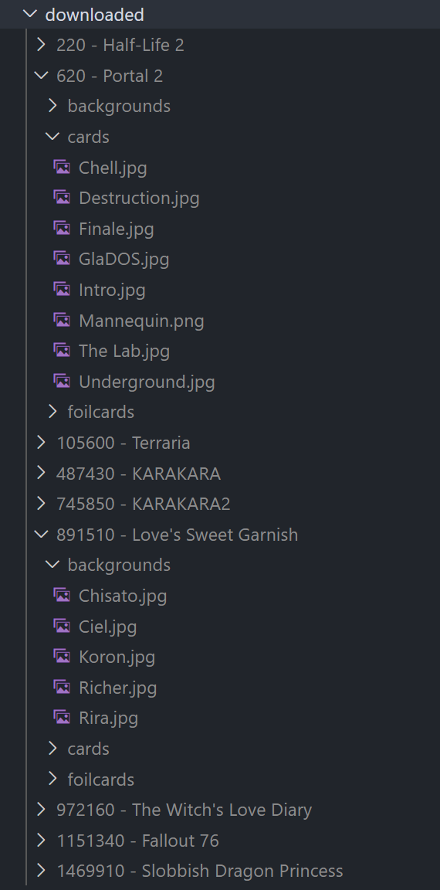
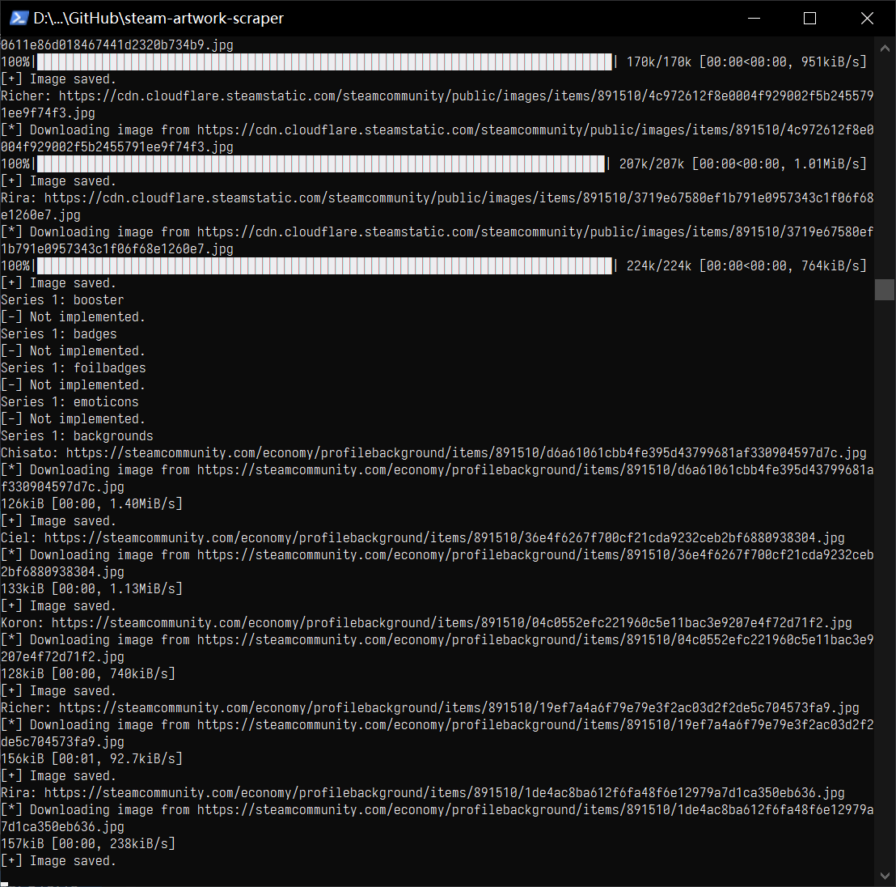

# steam-artwork-scraper
A Steam artwork scraper, using information from Steam Card Exchange (https://www.steamcardexchange.net/index.php?showcase)

Currently it only supports Cards (foil and common) and Backgrounds.

## Requirements

Python 3

```bash
requests
tqdm
bs4
```
* tqdm for download progress bar.

## Usage

```python
def show_help():
    print("Usage: -i <Steam Appid>")
    print("   or: --STEAM_APP_ID=<Steam Appid>")
    print("If you do not supply command line argument, the script will ask for the <Steam Appid> at startup.")
```

## Folder

`./downloaded/`



## Screenshot

